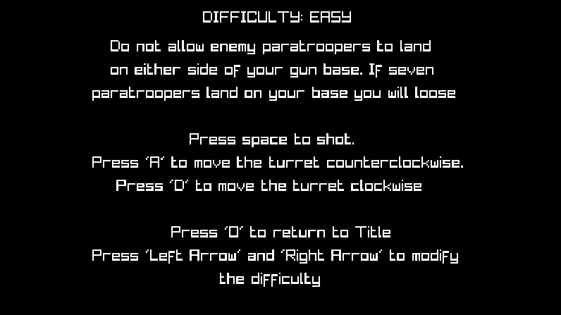
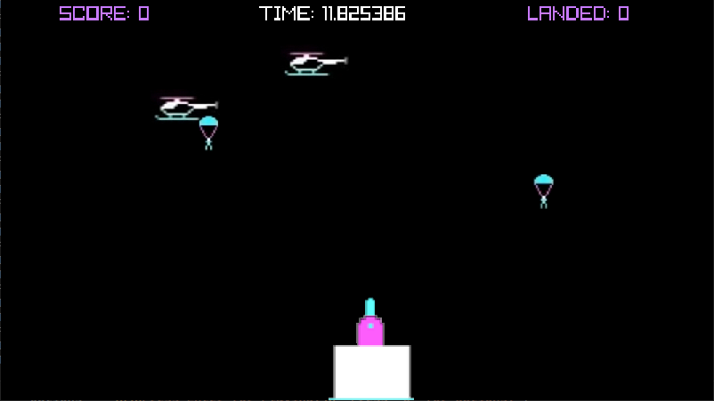
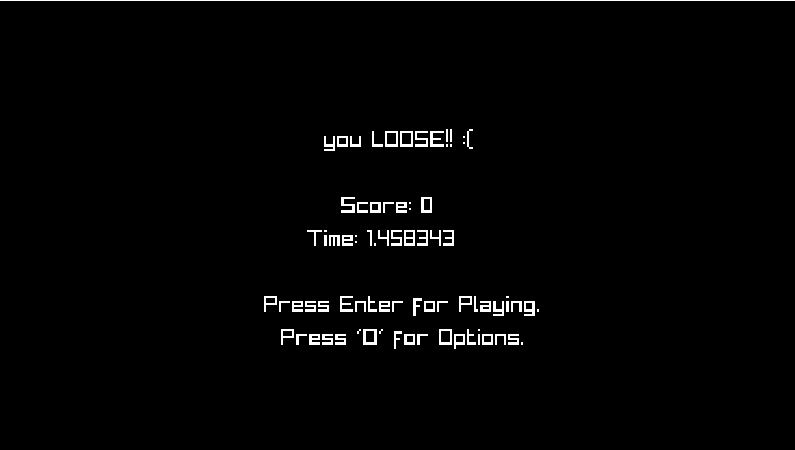

	 _______  _______  _______  _______ _________ _______  _______  _______  _______  _______  _______ 
	(  ____ )(  ___  )(  ____ )(  ___  )\__   __/(  ____ )(  ___  )(  ___  )(  ____ )(  ____ \(  ____ )
	| (    )|| (   ) || (    )|| (   ) |   ) (   | (    )|| (   ) || (   ) || (    )|| (    \/| (    )|
	| (____)|| (___) || (____)|| (___) |   | |   | (____)|| |   | || |   | || (____)|| (__    | (____)|
	|  _____)|  ___  ||     __)|  ___  |   | |   |     __)| |   | || |   | ||  _____)|  __)   |     __)
	| (      | (   ) || (\ (   | (   ) |   | |   | (\ (   | |   | || |   | || (      | (      | (\ (   
	| )      | )   ( || ) \ \__| )   ( |   | |   | ) \ \__| (___) || (___) || )      | (____/\| ) \ \__
	|/       |/     \||/   \__/|/     \|   )_(   |/   \__/(_______)(_______)|/       (_______/|/   \__/

# Paratrooper
### Descripción

En este juego controlas una torreta situada en la parte baja de la pantalla, que se puede rotar de izquierda a derecha con el fin de disparar al mayor número posible de helicópteros y soldados. El objetivo es evitar que aterricen siete soldados o más. 

El jugador gana puntos por cada soldado o helicóptero destruido, perdiendo un punto por cada disparo ejecutado. De esta manera, existe un incentivo para conservar disparos, y así, tratar de hacer la mayor puntuación posible.
### Funciones
A continuación se enumeran una serie de funciones añadidas además de los requisitos presentados en el enunciado de la práctica:

 - Implementación de diferentes niveles de dificultad (fácil, normal y experto). En función del nivel escogido en la pantalla de opciones, el número de tropas que aparezcan (tanto soldados como helicópteros) aumentará de forma considerable, siendo más o menos probable en función de dicho parámetro.

 
 - En la pantalla de juego, a mayores de los contadores de tropas aterrizadas y la puntuación del jugador, se visualiza el tiempo de partida transcurrido.

 

 - Añadidos los datos de puntuación y tiempo de partida en la pantalla de fin de juego.

 

 - Se incluyene efectos de sonido: disparos, explosiones, transiciones y hasta la banda sonora original del videojuego de 1982!

### Controles

Teclado:
 - En partida:
 	- A -> Mover torreta a la izquierda.
 	- D -> Mover torreta a la derecha.
 	- Espacio -> Disparar proyectiles.
	- Q -> Perder partida.
 - En la pantalla de opciones:
 	- Flecha izquierda -> Bajar la dificultad en la pantalla de opciones.
 	- Flecha derecha -> Subir la dificultad en la pantalla de opciones.
	- Enter -> Volver al inico.
 - Generales:
	- Enter -> Empezar a jugar.
 	- O -> Pantalla de opciones.

### Links

[Repositorio de github para el proyecto.](https://github.com/SugarMann/Paratrooper)